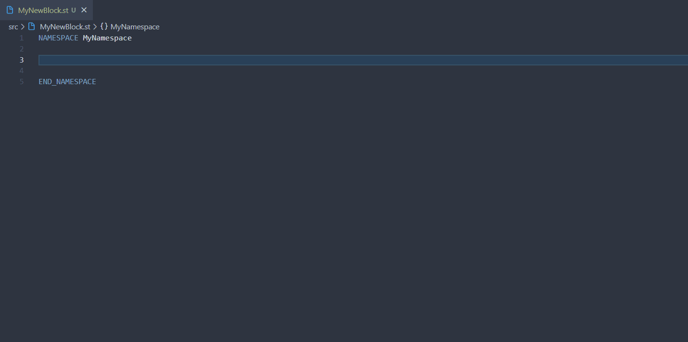
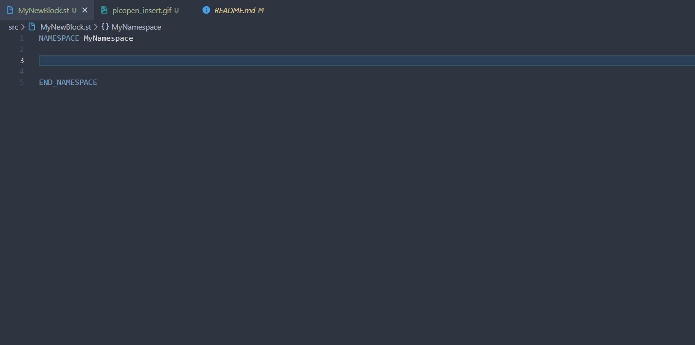

# PLCopen Snippets

The following block-template snippets for AX Code are based on the 
PLCopen standard **'Function Blocks for Motion Control' V2.0** which can also be found in the LGF library for TIA Portal [here](https://support.industry.siemens.com/cs/ww/en/view/109479728).

Besides this collection consists of 6 PLCopen snippets (3x "Execute"-variants / 3x "Enable"-variants) we also added 4x basic FC's and 4x basic FB's variants inspired by PLCopen that should emphasise you to build more predictable block interfaces.  

BEWARE ! This package has no OOP content 

<br/> 

## Install the snippets collection

To install the snippets collection to your workspace enter the following command in a terminal:

```bash
apax add @simatic-ax/plcopen-snippets --dev
```
> Installing snippet-packages to your project / ax code-instance may cause you to restart the IDE in order to make them work for the intellicense.

> To install this package you need to login into the GitHub registry. You'll find more information [here](https://github.com/simatic-ax/.sharedstuff/blob/main/doc/personalaccesstoken.md).

<br/>
<br/> 

## Insert PLCopen block templates

Available variants:
```json
"fb enable" : [" 1_simple | 2_adv | 3_adv"]
```
```json
"fb execute" : [" 1_simple | 2_adv | 3_adv"]
``` 
Differences: <br>
- all variants consists of the corresponding statemachines, all its needed variables and an proper error/ output-handling
- all *"_adv"* variants have an additional diagnostic-structure handling holding on to the block last error info
- the *"3_adv"* variant adds a frame to abort the enable/execute statemachines beforehand

<details><summary>Show Output example:</summary>



</details>
<br/>

## Insert general block templates

Available variants:
```json
"fb" : [" 1_simple | 2_simple | 3_simple | 4_adv "]
```
```json
"fc" : [" 1_simple | 2_simple | 3_simple | 4_adv "]
```
Differences: <br>
- the *"1_simple"* variant is the most basic frame of the block with no specialty
- the *"2_simple"* variant adds a simple frame to handle subfunction-block-status info
- the *"3_simple"* variant additional have a subfunction block-status info
- the *"4_adv"* variant have an additional diagnostic-structure handling holding on to the block last error info

<details><summary>Show Output example:</summary>



</details>
<br/>
<br/>

## Contribution

Thanks for your interest in contributing. Anybody is free to report bugs, unclear documentation, and other problems regarding this repository in the "Issues" section or, even better, is free to propose any changes to this repository using "Merge-Requests".

## License and Legal information

Please read the [Legal information](LICENSE.md)
