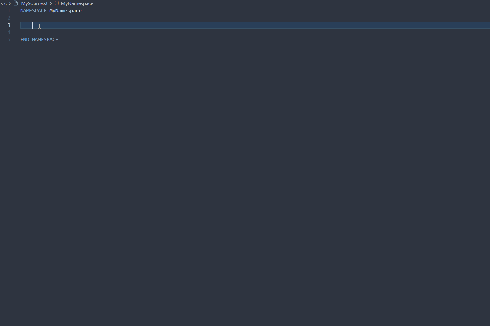
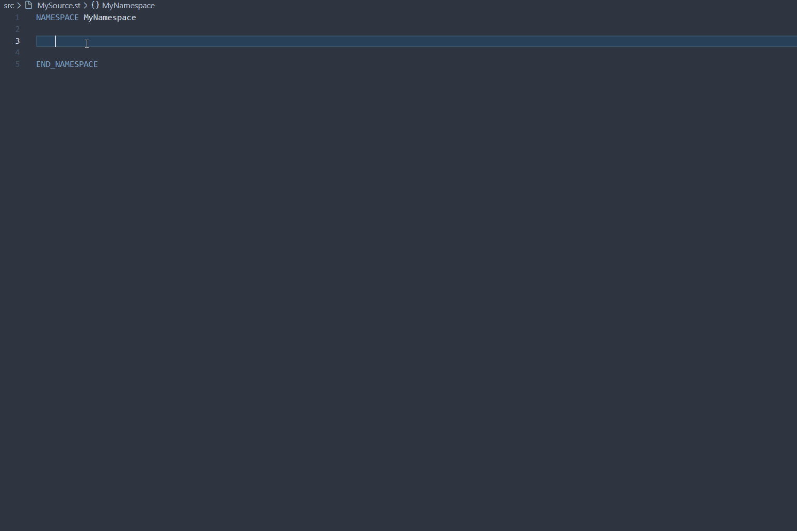

# PLCopen Snippets 

The following block-template snippets for AX Code are based on the
PLCopen-like standard **'Function Blocks for Motion Control' V2.0** which can also be found in the LGF library for TIA Portal [here](https://support.industry.siemens.com/cs/ww/en/view/109479728).

This collection consists of 6x PLCopen FB code-snippets (3x "Execute"-variants / 3x "Enable"-variants) plus 2x complementary structured-types. We also added 4x basic FC's and 4x basic FB's variants inspired by PLCopen, which in addition should emphasise you to build more predictable blocks(interfaces) with standardized execution behaviours.
These vscode snippets gives you a head-start in content creation for your very own SIMATIC AX library or application.

## About: PLCopen ##
*"The PLCopen organization has defined a standard for Motion Control blocks. This standard can be generalized in that way, that it can be applied to all asynchronous blocks. Asynchronous means in this context, that the execution of the function inside the block extends over multiple (more than one) execution cycles of the PLC, e.g. for communication, closed loop control or motion control applications."*
<br/>
<br/>

### A function block with an **"enable"** - behaviour: ###
*"Blocks which are started and initialized only once and afterwards remain in operation to respond to inputs have an "enable" input parameter.
Example: A communication block (acting as server) waits after initialization for incoming connection requests from a client. After a successful data exchange the server waits for other incoming connection requests.
Setting the parameter "enable" starts the execution of an asynchronous task. If "enable" remains set, the task execution remains active and new values are being accepted and processed.
Resetting the parameter "enable" will shut down the working state of the block."* 
.. read [more](https://support.industry.siemens.com/cs/ww/en/view/109479728)
> #continuous-asynchronous #enable

<br/>


### A function block with an **"execute"** - behaviour:
*"Blocks, which get executed only once have an input parameter "execute".
Example: A communication block (client) requests data of a server only once. This is triggered by an edge at the input signal "execute". After the processing the reply the execution is done. A new request is placed by another edge on "execute". A rising edge on "execute" starts the task and the values at the input parameters are applied.
Any changes to the values after the start of the task only take effect after a start of a new task, unless "continuousUpdate" is being used.
The reset of the parameter "execute" does no stop the execution of the current task but has an influence on the display duration of the execution status. If "execute" gets reset before the current task has finished, then the parameter "done", "error" and "commandAborted" will be set for only one cycle."*
.. read [more](https://support.industry.siemens.com/cs/ww/en/view/109479728) <br/>
> #single-asynchronous #execute

<br/>
<br/>

# Install the snippets collection

Before installing the snippets collection, the URL to the package registry need to be defined in the apax.yml

```yml
registries:
  '@simatic-ax': 'https://npm.pkg.github.com/'
```

Install the snippets collection to your workspace by entering the following command in a terminal:

```bash
apax add @simatic-ax/plcopen-snippets --dev
```

> - For installing this package you need to login into the GitHub registry. You'll find more information [here](https://github.com/simatic-ax/.sharedstuff/blob/main/doc/personalaccesstoken.md). 
> - Installing snippet-packages to your project / ax code-instance may cause you to restart the IDE in order to make them work for the intellicense.

<br/>
<br/>

## Use PLCopen block templates
You can use the intellicense in the scope of a .st file to make use of the snippets. <br> 
Just start typing-in the following  available variants:

```json
"fb, plcopen, enable," : [" 1_simple | 2_adv | 3_adv "]
```

```json
"fb, plcopen, execute," : [" 1_simple | 2_adv | 3_adv "]
```

Differences: <br>

- all variants consists of the corresponding statemachines, all its needed variables and an proper error/ output-handling
- all *"#_adv"* variants have an additional diagnostic-structure handling holding on to the block last error info
- the *"3_adv"* variant adds a frame to abort the enable/execute statemachines beforehand
  
Complementary plc-types: <br>

```json
"type, plcopen," : ["Diagnostics struct"]
```

```json
"type, plcopen," : ["FbStates enum"]
```
These types can be used to complete a clean block & type plcopen construct. After insertion you easily can change the name and it's type-references in the block-templates by

<details close>
<summary>Show usage example:</summary>



</details>

<br/>
<br/>

## Use general block templates
You can use the intellicense in the scope of a .st file to make use of the snippets. <br> 
Just start typing-in the following  available variants:

```json
"fb" : [" 1_simple | 2_simple | 3_simple | 4_adv "]
```

```json
"fc" : [" 1_simple | 2_simple | 3_simple | 4_adv "]
```

Differences: <br>

- the *"1_simple"* variant is the most basic frame of the block with no speciality
- the *"2_simple"* variant adds a simple frame to handle subfunction-block-status info
- the *"3_simple"* variant additional have a subfunction block-status info
- the *"4_adv"* variant have an additional diagnostic-structure handling holding on to the block last error info

<details close>
<summary>Show usage example:</summary>



</details>
<br/>
<br/>

# Notes from the developer

BEWARE ! 
- This package currently has no ST OOP content
- This package only ships .json vs-code snippet files that work for .st files
- The code-snippets follow our [SIMATIC AX style-guide](https://console.simatic-ax.siemens.io/docs/st-styleguide) for ST-programming
- The snippets may or may not include TIAX restrictions, which unfortunatly cause unwanted transformations or compile errors using it blank in "AX2TIA" library-projects, that used to be converted to TIA Portal. Please always check back the latest [news](https://console.simatic-ax.siemens.io/docs/ax2tia/restrictions) on these restrictions. There are no workarounds implemented.
<br>

Happy coding ... 

🐱‍💻 BEEP, BOOP, BEEP, BEEP, BOOP 🐱‍🏍

<br/>
<br/>

# Contribution

Thanks for your interest in contributing. Anybody is free to report bugs, improvements, unclear documentation, and other problems regarding this repository in the "Issues" section ... or, even better, is free to propose any changes to this repository using "Merge-Requests". The CODEOWNERS will take care.

## License and Legal information

Please read the [Legal information](LICENSE.md)
